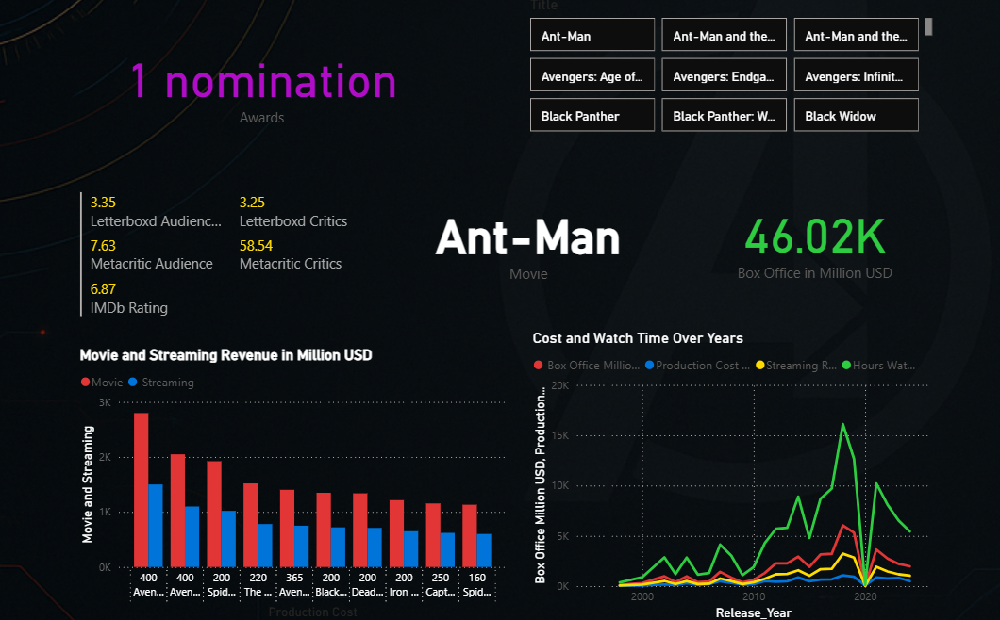

# 💥 MARVELytics – Power BI Dashboard of the MCU Universe

## 🧾 Description

**MARVELytics** is a custom-designed Power BI dashboard that visualizes and analyzes the journey of the **Marvel Cinematic Universe (MCU)** from Phase 1 to Phase 5+. Inspired by the holographic tech aesthetic of **Tony Stark’s J.A.R.V.I.S. interface**, this dashboard combines immersive visuals with actionable insights on box office performance, ratings, production budgets, and more.

This project is perfect for:
- Marvel fans
- Data visualization learners
- Power BI enthusiasts  
...who want to explore cinematic data in a **superheroic** way.

---

## 📂 Files Included

| File                          | Description                                            |
|-------------------------------|--------------------------------------------------------|
| `Dashboard.pbix`                     | Power BI file containing the full dashboard            |
| `marvel_movies_complete_dataset.csv` | Dataset used to build the visuals                 |

---

## 📊 Features

- 📈 **Box Office & Budget Analysis**
- 🎬 **Phase-wise Movie Breakdown**
- ⭐ **IMDb, Metacritic & Letterboxd Ratings**
- 🧠 **Correlation Between Ratings & Revenue**

---

## 🎨 Dashboard Theme

The dashboard uses an **Avenger-style interface**:
- Dark holographic background
- Core Marvel colors (red, blue, gold)
- Clean and minimal layout with strong contrast
- Transparent cards inspired by Iron Man’s HUD visuals

---

## 🛠 How to Use

1. Clone or download this repository.
2. Open `Dashboard.pbix` in **Power BI Desktop**.
3. When prompted, allow access or refresh the dataset.
4. Explore the dashboard with slicers and visuals!

---

## 🔮 Future Improvements

- 📡 Power Query-based automatic data updates via APIs
- 💰 Integration with live box office trackers
- 🎞️ Trailer and character tooltip popups
- 📱 Mobile-optimized visual layout

---

## 💡 Inspiration

This dashboard is inspired by the cinematic world of Marvel and the immersive tech experience of Tony Stark’s lab. It's not just a data report—it's an experience meant to make you feel like you're analyzing Avengers intel inside **Stark Tower**.

---

## 📸 Screenshots

